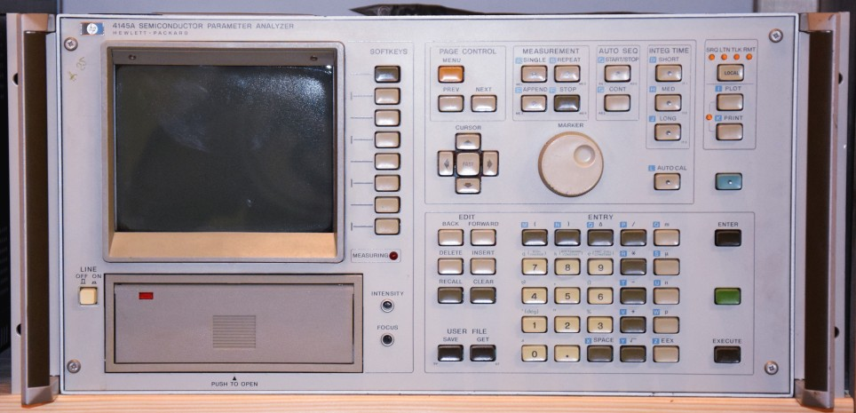

# HP 4145A Semiconductor Parameter Analyzer

*companion github site to the [HP 4145A Modifications and Repair](https://www.youtube.com/watch?v=gLGCO4h7570) series on youTube*

---

## Contents

- disk: Contains floppy disk images and [further information](disk/readme.md) on floppy drive specifics
- doc: documents and datasheets
- images: images and graphical explanations
- models: 3D-Printed parts for the HP4145 floppy replacement with a HcX board
