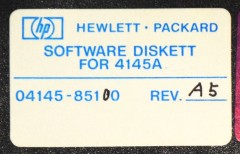
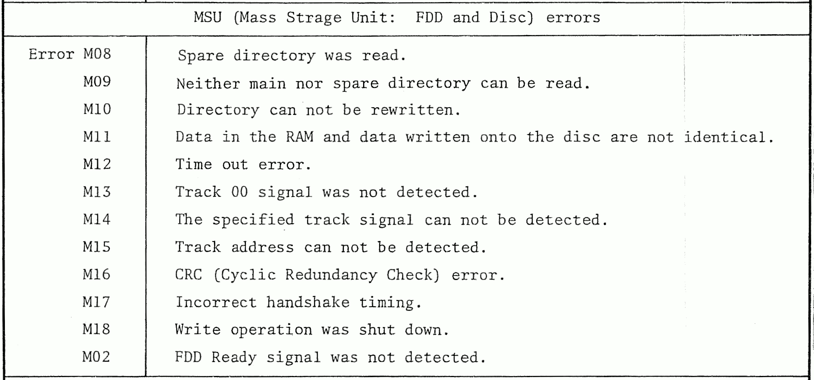

# disk - files regarding the floppy disk in the HP4145A

## Introduction

The HP4145A comes with a 5 1/4-inch floppy disk. On this disk user data **and** the operating system is stored. If the floppy disk or the drive is bad, the HP4145A can not even boot. There are multiple solutions for this:
- replace the floppy drive and disk completely with an [HxC-Board](https://hxc2001.com/) as shown in [this video](https://www.youtube.com/watch?v=gLGCO4h7570). Files for this are in the `HxC` subdirectory.
- create new floppies to continue use of the built-in drive. This gets explained in the following section.

All images herein are from revision 5 with datecode `131082`. 

### floppy disk type

The floppy disk in the HP4145A uses a unique data format which is not compatible with standard formats. This means it can not be read or written by standard PCs without special tools.
The disk itself is a single-sided (1S), single-density (SD) 40-track floppy. The FM-encoded disk stores its data in 9 sectors/track with a sector size of 256 bytes. Sector numbering goes from 1..9.
For further information on data structure and formatting take a look at the [HP Journal from Oct. 1982](https://www.hpl.hp.com/hpjournal/pdfs/IssuePDFs/1982-10.pdf) or the dataheets of the instrument.

---

## create new floppies

Creating a new floppy for the HP4145A can not be done by the instrument itself (this feature gets added in the HP4145**B**). This means an decently old computer and floppy drive is required. If no old PC and drive is available you may consider building a custom copy hardware as done by Kitsune Denshi: [video](https://www.youtube.com/watch?v=ZCxzYmUX3WA) and [article](https://www.kitsune-denshi.net/equipment:hp4145a).

### Basics
This article will not describe the basics of floppy drives, disks and its architectures. It is strongly recommended to watch the 3-part video series of Courious Marc to get familiar with floppies and the overall process: [Working with 5.25" Floppy Disks](https://www.youtube.com/watch?v=rbxPW86B84E&list=PL-_93BVApb58SkNrwTjOFJJIZobCLzhzQ).

As desrcibed above the floppy format of the HP4145A is quite unique and will not be recognized by any standard software or OS. But there are tools for Microsoft's DOS avaiable to read, modify or write such disks: `OMNIDISK` and `IMAGEDISK`. For this article only `IMAGEDISK` is actually required. It is still maintained by its developer an can be found on his site: [Daves old computers](http://dunfield.classiccmp.org/img/index.htm).

As explained in the videos by Courious Marc an oldish Motherboard with a "good" (feature rich) floppy controller and a 5 1/4-inch floppy drive is required. 
- For the motherboard i.e. a `FIC PAG-2130` can be used. It has the `VIA VT82C686A` southbridge controller which incorporates the floppy drive controller (FDC).
- For the drive i.e. the very popular `NEC JU-475` can be used. This is a 80-track HD drive which **can** read and write 40-track single density (SD, which means FM encoding) floppies even if many sources claim the opposite. For this, a small hardware modification is necessary to change the drive motor speed from [360 to 300RPM](http://dunfield.classiccmp.org/img42841/speed300.htm) which enables real 250kbps transmissions.
- As Operating system Windows 98 SE or anything older migth be used; for disk operations we must be in DOS mode (i.e. by pressing `F8` at startup).

### Setup

Build your PC setup with a working FDC and drive combination. Install a fully DOS-compatible system, copy `IMAGEDISK` and the image file `HP4145a.imd` of the `imagedisk` subdirectory to your PC. If you have a HD floppy drive, make the modification so it runs on 300RPM. Insert a 5 1/4" floppy - all 1S/2S SD/DD floppies will work (48 tpi). HD floppies (96 tpi) can not be used.
Start in DOS mode, fire up imagedisk by calling `imd`. Edit `S)ettings`: select correct drive, set cylinders to 40 for SD/DD-drive, leave it at 80 for HD drive. Set sides to 1. Other defaults can be kept.
- On a 40-track drive you are ready now: `W)rite` the image to the disk.
- On a 80-track drive (HD) some additional work is needed, first of all a full formatting. Edit `S)ettings`: cylinders=80, sides=1, double-step=off, format fill=FF, interleave=1. Now `F)ormat` the disk. Set it to FM encoding with 250kbps, 9 sectors per track, starting at 1 and a sector size of 256 bytes. When formating is finished, change the `S)ettings` again: cylinders=80, sides=1, double-step=on, interleave=1. Now `W)rite` the image to the disk.

You should have a fully working new floppy for your HP4145A now.

### Notes

**HP4145A error messages**

If the HP instrument errors out at startup with a `M##` error, take a look at the manual, table 8-1 to find out more:

**floppy jargon**

Sadly the floppy jargon is full of pitfalls with different names for equal things:
- cylinders = tracks
- SD (single density) means also FM encoding
- DD (double density) means also MFM encoding
- HD (high density) means also MFM encoding with 80 tracks at 360RPM
